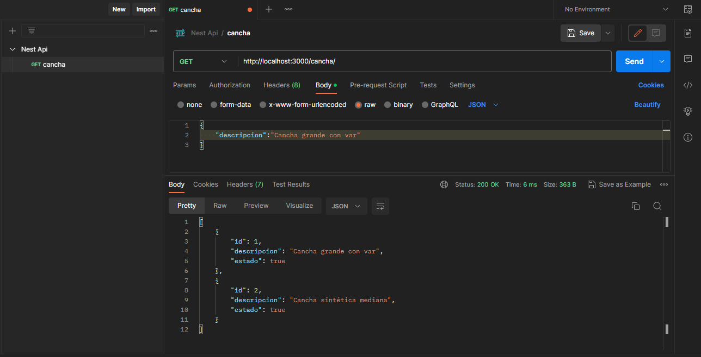

## NEST SEGUNDO PARCIAL

## Imágenes 

# 1. Utilizando NEST Desarrollar la ruta de un servicio REST que aplique arrays como persistencia basada en una de sus entidades maestras asignadas al inicio del parcial.

# Generando recursos 

# DTO Clase Cancha

# Service  Cancha

# Pruebas en POSTMAN 

## GET

## POST

## PUTCH

## DELETE

## GET 

