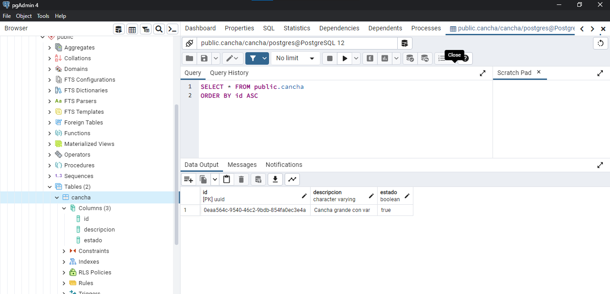

## NEST SEGUNDO PARCIAL

## Imágenes 

# 2.Utilizando NEST Desarrollar la ruta de un servicio REST que aplique una base de datos relacional o no relacional como persistencia basada en una de sus entidades maestras asignadas al inicio del parcial.

## SE USO POSTGRES

# Generando recursos 

# Base de datos creada de Cancha

# Ejecutando 

# Atributos creado mediante nest

# Pruebas en POSTMAN 

## GET

## POST

## PUTCH

## DELETE

###  GUARDANDO EN BASE DE DATOS MEDIANTE POSTMAN

###  MOSTRANDO  EN  LA BASE DE DATOS EL DATO GUARDADO

