## #1 

## Screenshots

## Se creo el recurso de Canchas

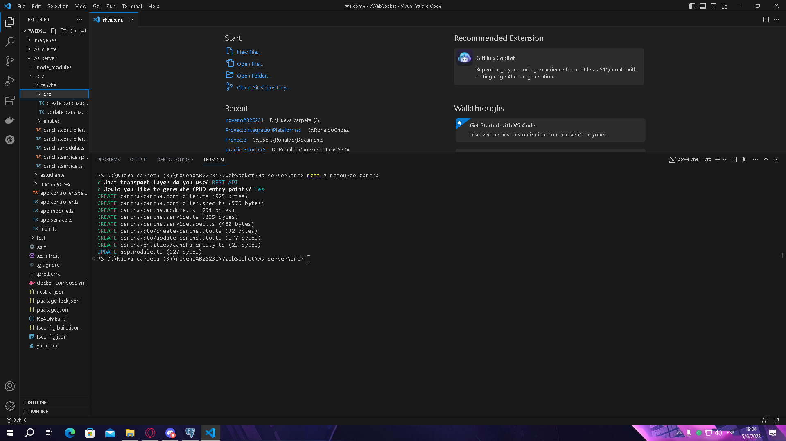

## Insertando Cancha 1 y Cancha 2 (y otros por error)

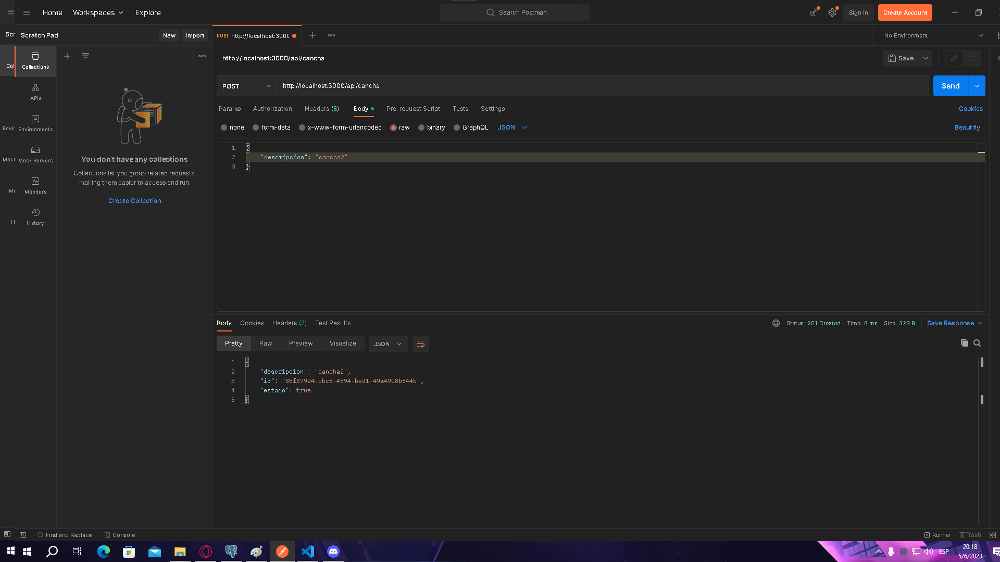

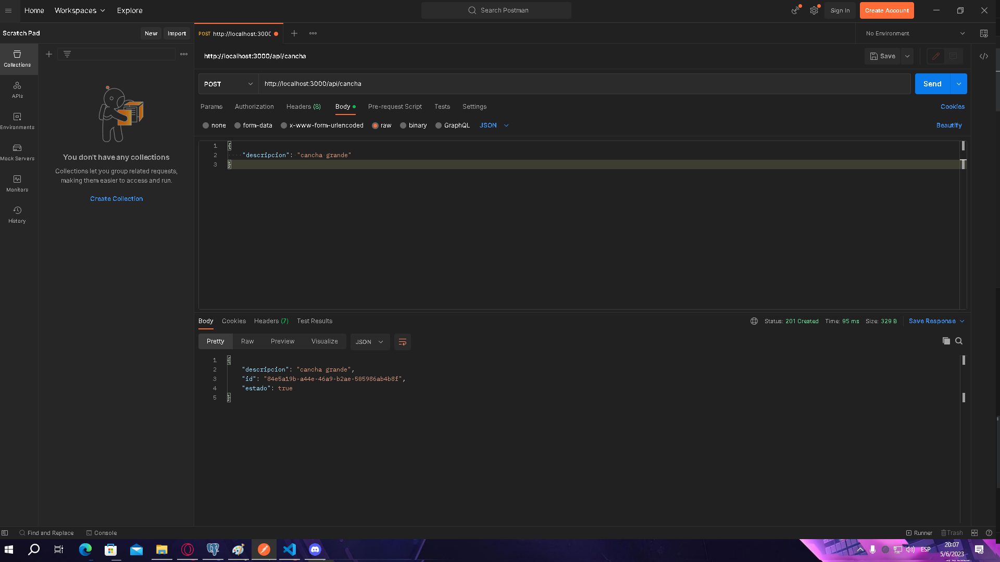

## Consultando Canchas agregadas (GET)

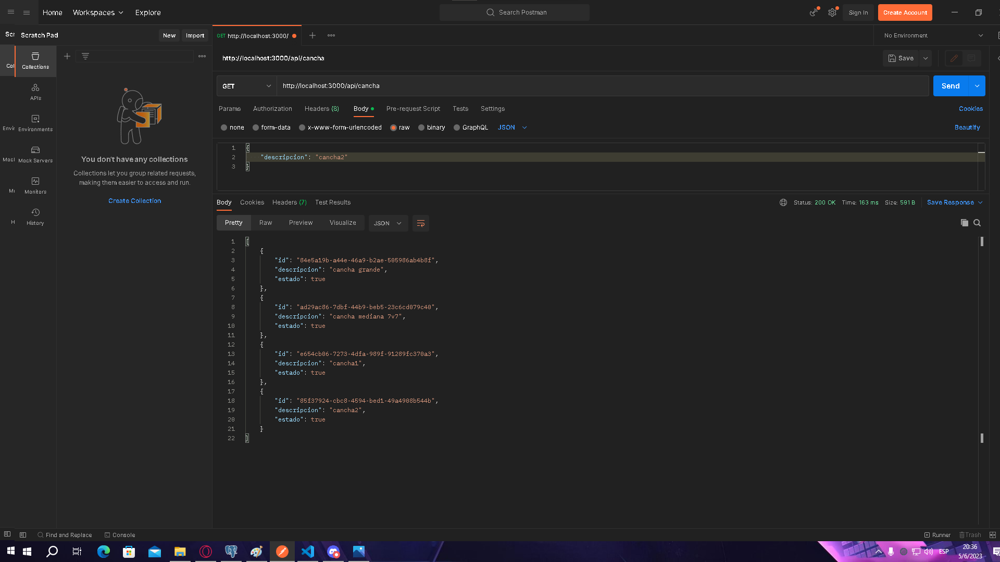

## Iniciamos Servidor y Cliente
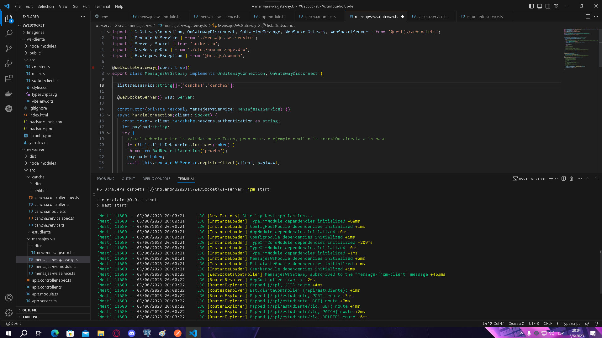

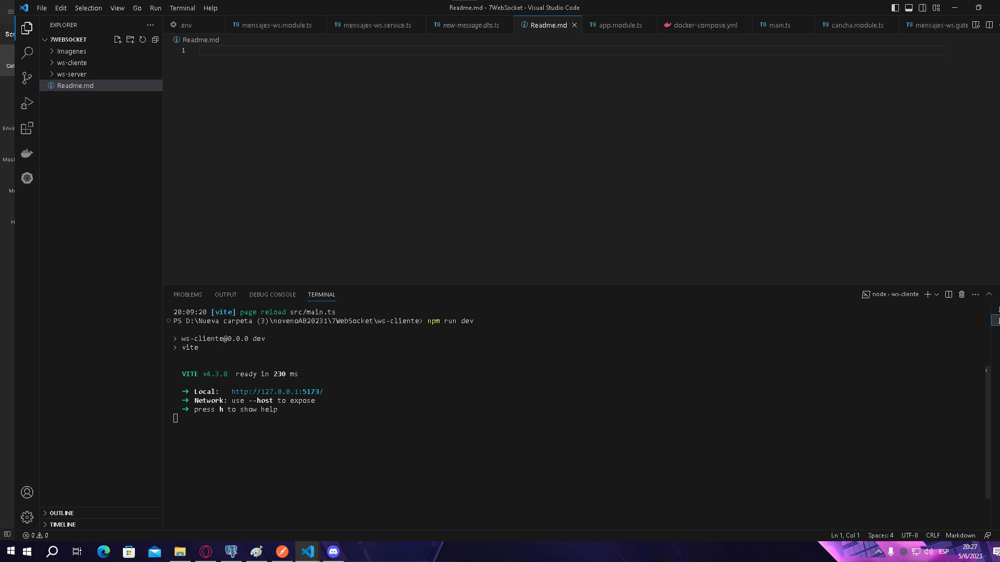

## DESDE FRONTEND
## Escribimos cancha agregada y ponemos conectar

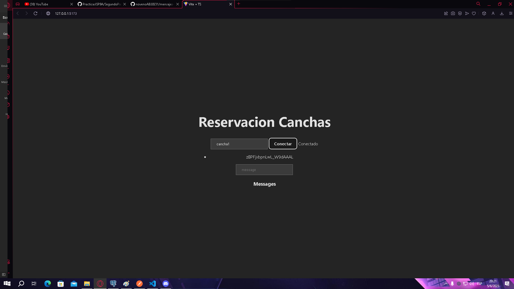

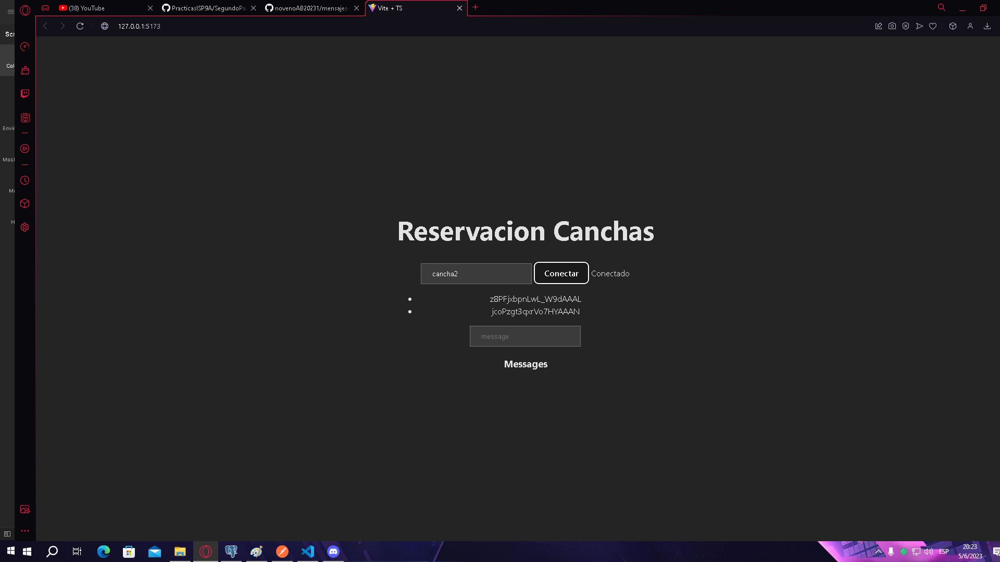

## Ahora agregamos mensajes desde cancha1 y cancha2
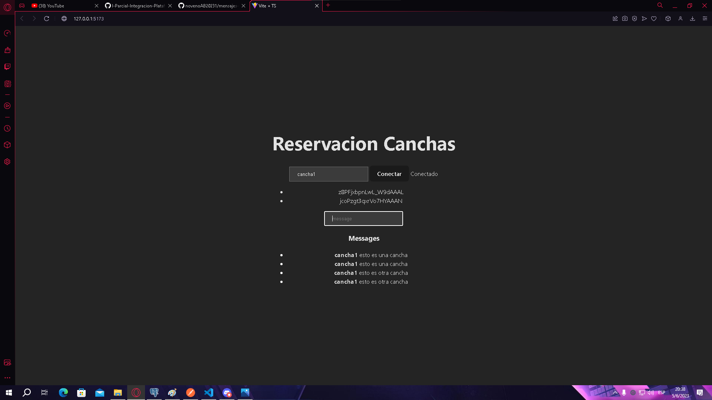

## Evidencia de los datos en postgres
## Mostrar los datos en la Base de datos
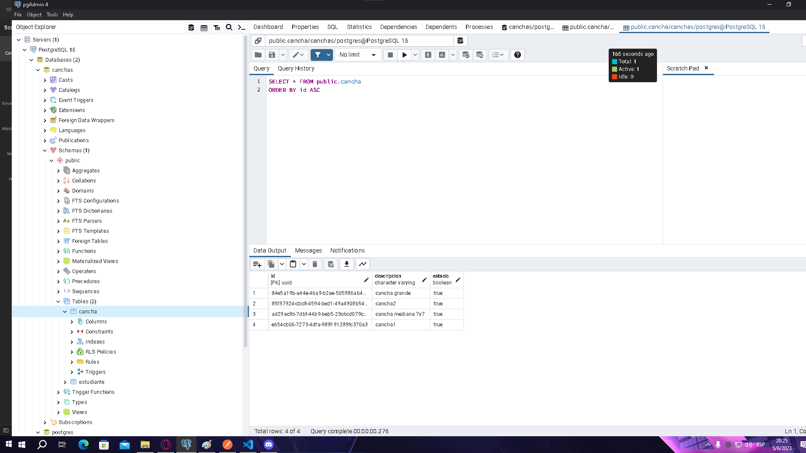

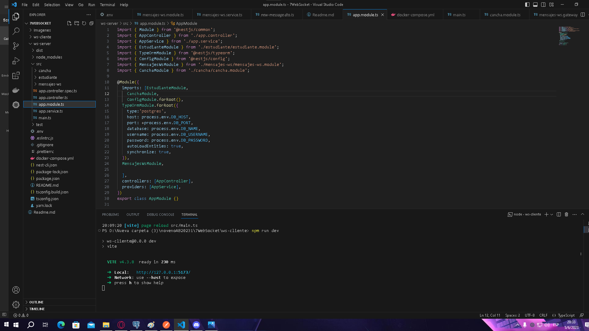

## Evidencia desde el array activos
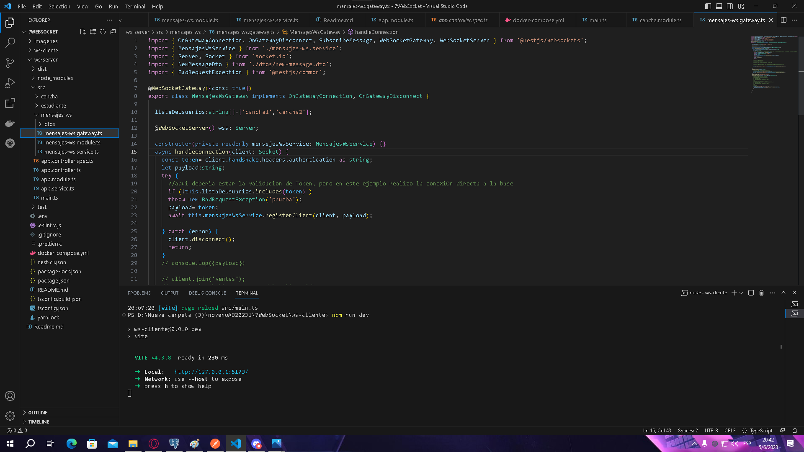

