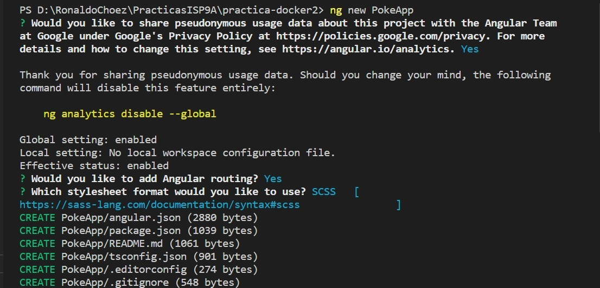
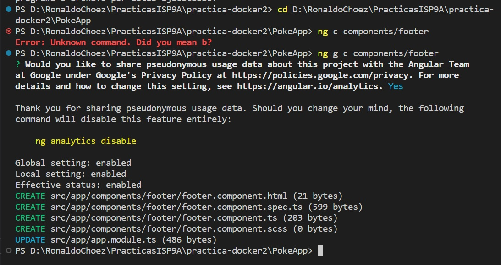
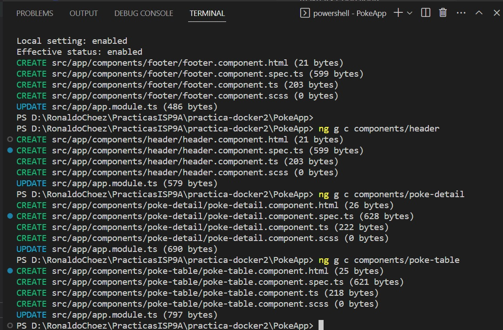
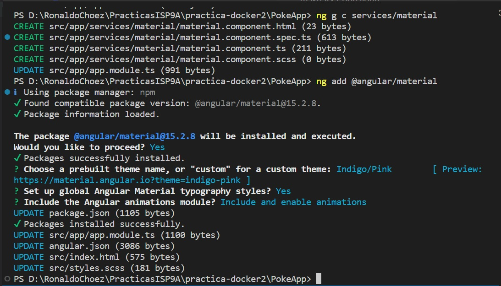
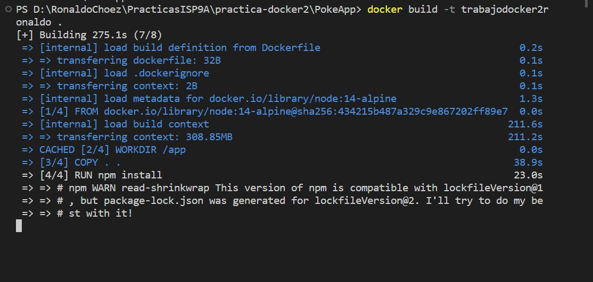
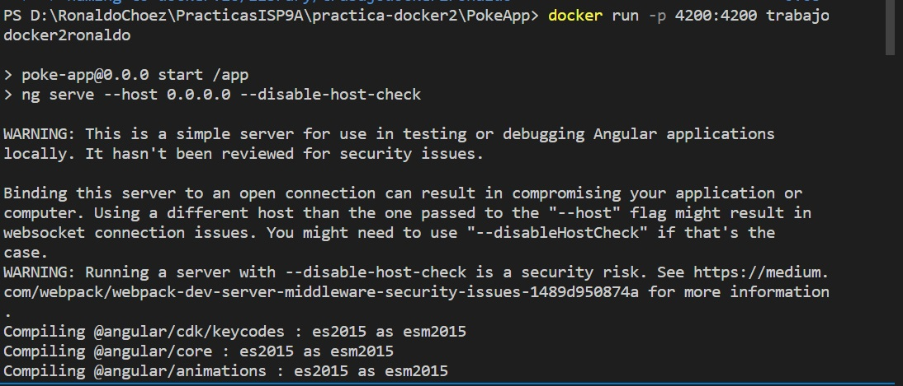
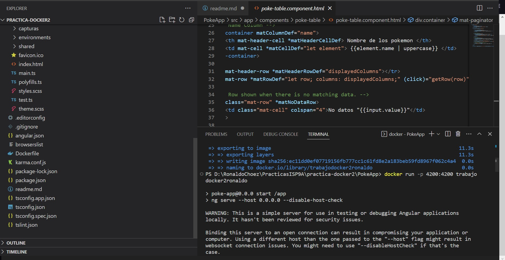
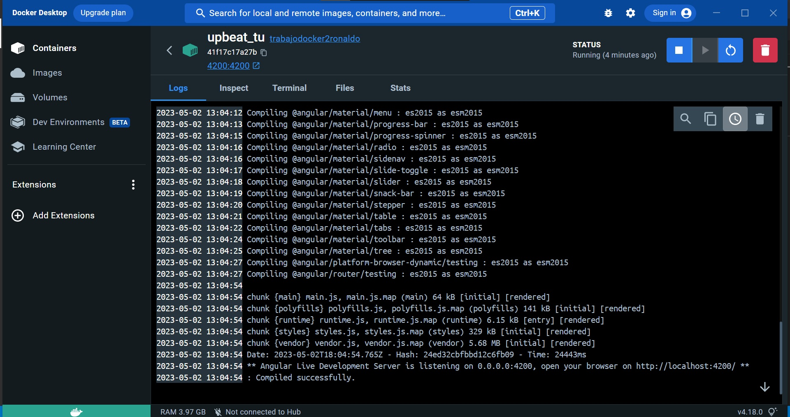
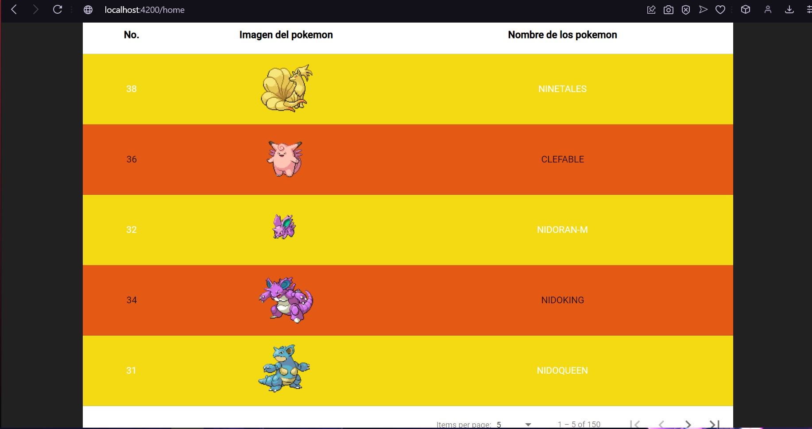
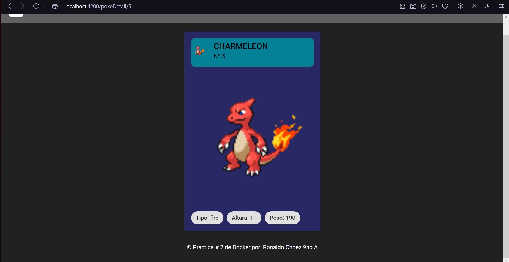

## ScreenShots

USANDO FUNCIONALIDADES PARA CREAR EL PROYECTO, COMPONENTES, SERVICIOS Y AÑADIR MATERIAL DE ANGULAR

Se crea un proyecto en angular para despues ver las funcionalidades y servicios con el respectivo material para poder trabajar en docker.

Dockerizamos y vemos las funcionalidades

